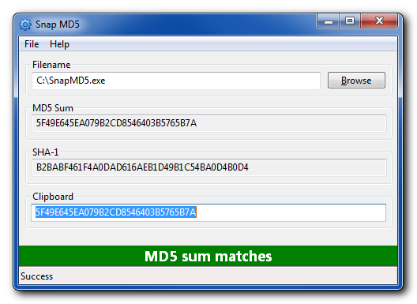

#SnapMD5

## Description
Snap MD5 lets you quickly and easily validate the MD5 or SHA-1 hash of a file you downloaded. To use it, copy the MD5 or SHA1 hash of a file you're going to download to the clipboard. Once the file has downloaded, run Snap MD5 and either browse to the downloaded file or pass the path to the file as a parameter.

Snap MD5 will calculate the MD5 and SHA1 hash of the file and indicate if the sum matches what you stored in the clipboard. You can close it with the Esc key.

Filenames with unicode characters are fully supported.

## Supported Platforms
Windows 7 and up, 32 and 64-bit.

Please report any issues you encounter.

## Installation

No installation required. Just unzip the downloaded archive and run SnapMD5.exe

## Build instructions

Note: [Lazarus](http://www.lazarus-ide.org/) is required.

Open SnapMD5.lpi in Lazarus, and go to Run &gt; Build (Shift+F9).

## Author

Written by [Dan Hersam](http://dan.hersam.com).

